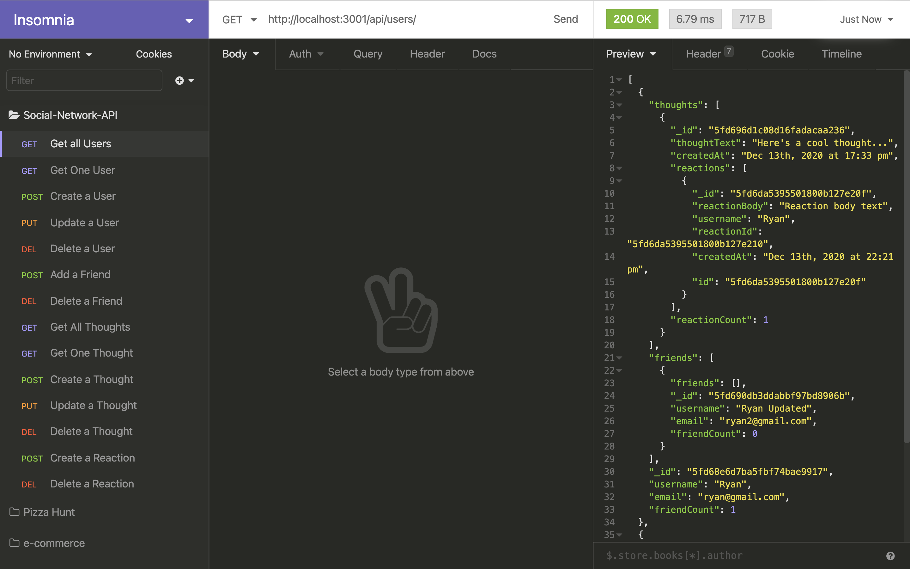

[](https://opensource.org/licenses/MIT)

# NoSQL Social Network API

## Created by:

### Nikita Pokamestov

## License

NoSQL Social Network API is licensed under the

[](https://opensource.org/licenses/MIT)

MIT License

A short and simple permissive license with conditions only requiring preservation of copyright and license notices. Licensed works, modifications, and larger works may be distributed under different terms and without source code.
Permissions | Limitations  |   Conditions
------------ | ------------  | ------------
Commercial use | Liability |   License and copyright notice
Modification | Warranty    |
Distribution |     |
Private use |     |

## Description

Social Network API using NoSQL

## Table of Contents

* [Installation](#installation)

* [Usage](#usage)

* [Contributing](#contributing)

* [Tests](#tests)

* [Link](#link)

* [Screenshot](#screenshot)

* [Questions](#questions)

## Installation

To Install necessary dependencies, run the following commands:  

```
git clone https://github.com/npokamestov/social-network-api.git
```

```
npm i
```

## Usage

```
npm start
```

## Contributing

If you want to know about contributing to the repo:

Reach out to my GitHub Repo

## Tests

To run the tests, run the following command:

```
n/a
```

## Link

[Video Walkthrough](https://drive.google.com/file/d/17oa_h83Z6yGLpGy9P8LA70hZvXN26W2C/view)

## Screenshot



## Questions?

If there are any questioins please refer to this email or leave a comment in the repository

Email: npokamestov@yahoo.com

Github Website: https://github.com/npokamestov/
